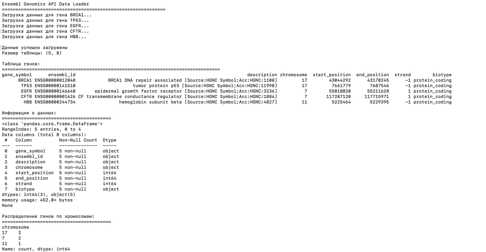

# Data Engineering Projects

Репозиторий для проектов по инженерии данных.

## О датасете

### Genetic Disorders Prediction
Работа с медицинскими данными для прогнозирования генетических нарушений.

**Источники данных:**
- [Kaggle: Predict the Genetic Disorders Dataset](https://www.kaggle.com/datasets/aibuzz/predict-the-genetic-disorders-datasetof-genomes)
- [Google Drive: Diabetes Dataset](https://drive.google.com/file/d/16T11Jo7CuSfgaadz5CLdwTyQRvrDLvSM/view?usp=drive_link)

**Контекст:**
Генетические нарушения - это заболевания, вызванные мутациями ДНК или хромосомными аномалиями. Многие известные болезни связаны с этими унаследованными мутациями. Генетическое тестирование - это важный инструмент, который позволяет пациентам принимать обоснованные решения о профилактике, лечении и раннем выявлении.

С ростом населения исследования показывают тревожное увеличение частоты этих нарушений. Значительным фактором является низкая осведомленность общественности о важности генетического тестирования. Для борьбы с этим и предотвращения трагических исходов крайне важно проводить генетический скрининг во время беременности.

## Структура проектов

### [api_example](api_example/) - Genomics API Reader
Проект для работы с Genomic API (Ensembl). Включает:
- Загрузку данных о генах через REST API
- Обработку и анализ геномных данных
- Визуализацию результатов

**Технологии:** Python, Pandas, Requests, Ensembl REST API



### [data_loader_project](data_loader_project/) - Data Loading and Validation
Проект для загрузки и валидации медицинских данных. Включает:
- Загрузку данных из Google Drive
- Валидацию и очистку медицинских данных
- Автоматическое определение типов данных
- Предобработку данных для анализа

**Технологии:** Python, Pandas, Data Validation, ETL processes


### [notebooks](notebooks/) - Exploratory Data Analysis
Jupyter ноутбуки для разведочного анализа данных:
- EDA медицинских данных пациентов
- Анализ структуры и качества данных
- Визуализация распределений и выбросов

**Технологии:** Python, Pandas, Jupyter, Data Analysis

## Установка и запуск

Для каждого проекта есть отдельные инструкции в соответствующих папках.

### Общие зависимости:
```bash
pip install -r requirements.txt
Пример работы
Data Loader Project
https://data_loader_project/scrnshot.png

EDA Analysis
Анализ завершен. Отчет доступен в ноутбуке

Автор
Анна Самойлова

Лицензия
Проекты распространяются под лицензией MIT. Подробнее см. в файле LICENSE.