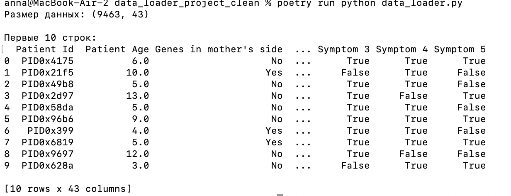

# data_ingeneering
[https://www.kaggle.com/datasets/imtkaggleteam/diabetes?resource=download](https://www.kaggle.com/datasets/aibuzz/predict-the-genetic-disorders-datasetof-genomes)
https://drive.google.com/file/d/16T11Jo7CuSfgaadz5CLdwTyQRvrDLvSM/view?usp=drive_link

Genetic disorders are health conditions caused by DNA mutations or chromosomal abnormalities. Many well-known diseases are linked to these inherited mutations. Genetic testing is a critical tool that empowers patients to make informed decisions about prevention, treatment, and early detection.
As populations grow, studies indicate a concerning rise in the incidence of these disorders. A significant factor is the low public awareness of genetic testing's importance. To combat this and prevent tragic outcomes, it is crucial to perform genetic screening during pregnancy.

## Первые 10 строк после выполнения команды:

